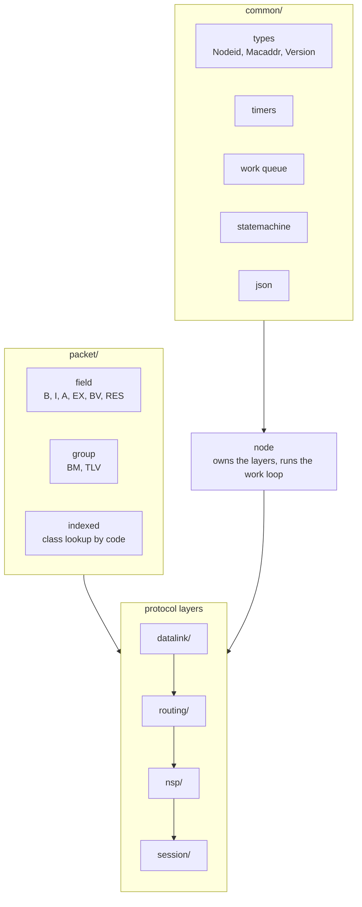
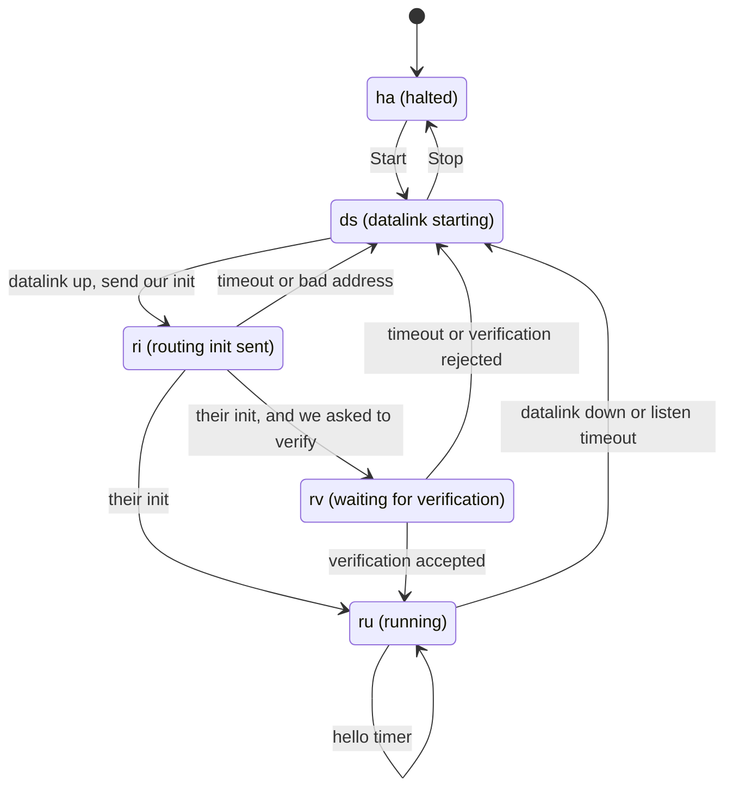
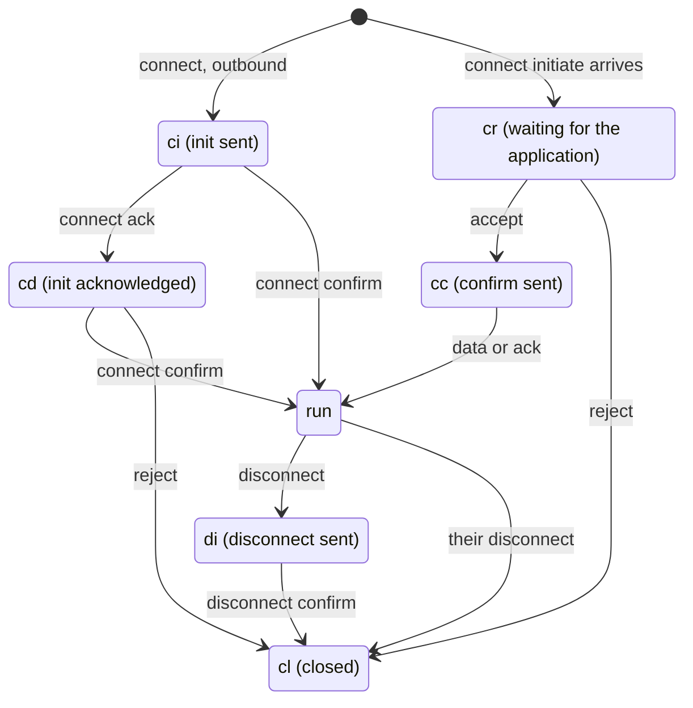
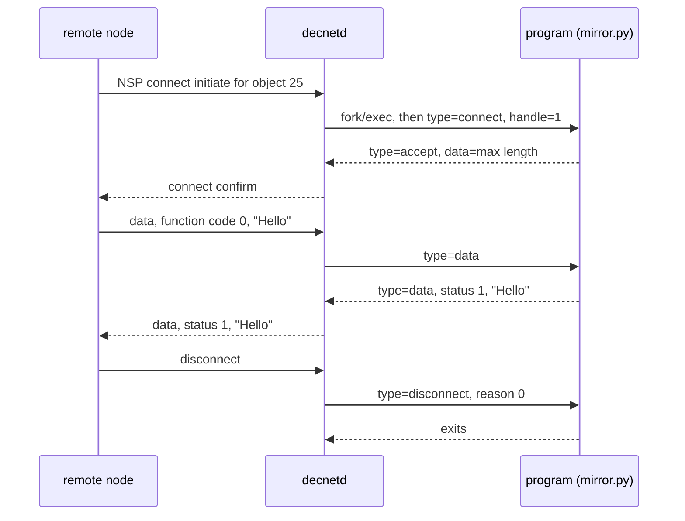

# Design notes

How the C++ port is structured and where it differs from PyDECnet.

## Scope

PyDECnet is about 27,000 lines covering data links, routing, NSP, session
control, MOP, NICE, event logging and HTTP monitoring. The network mapper
(`mapper.py`) is not ported. DAP/FAL is planned but last.

## Overview



`Node` owns the work queue, the timer wheel and one object per layer, and
runs the loop that dispatches work items. Helper threads do blocking I/O
and post work back to the node thread. Layer state is only touched from
the node thread.

## Packet layouts

PyDECnet describes packet layouts as tuples and generates encode/decode
methods with a metaclass. Here a layout is a `constexpr` tuple of field
specs, and `encode`/`decode` use `std::apply` over it:

```cpp
struct Simple : Packet<Simple> {
    std::uint8_t  code;
    std::uint16_t count;
    Bytes         name;
    Nodeid        src;

    static constexpr auto layout = fields (
        field<B<1>>        (&Simple::code,  "code"),
        field<B<2>>        (&Simple::count, "count"),
        field<I<16>>       (&Simple::name,  "name"),
        field<NodeidField> (&Simple::src,   "src"));
};
```

Derived layouts use `extend (Base::layout, ...)`.

Field types: `B`, `BV`, `I`, `A`, `EX`, `SIGNED`, `RES`, `Payload`,
`Nodeid`, `Macaddr`, `Version`. `BM` packs bit fields into one integer.
`TLV` handles tag/length/value lists, with `std::optional` members for
absent items.

## Packet class registry

Packet families that share a header are looked up by a code field.
Registration is explicit:

```cpp
DN_REGISTER_PACKET_MASKED (RoutingPacketBase, ShortData, 0x02, 0xc7);
```

Registrations support a mask (a class claims every key whose masked bits
match) and nested indexes (the class found can itself be an index keyed on
another field).


Phase III and Phase IV level 1 routing messages share code 0x07 and are
distinguished by the checksum seed (1 for Phase IV, 0 for Phase III), so
the checksum residue is used as the index key.

Registration goes through a function named by `DN_PACKET_INDEX_REGISTERED`
rather than static initialisers, because the linker drops archive members
from `libdecnet.a` that nothing references.

## Threading

Same model as PyDECnet: one thread per node running a work loop, with
helper threads for blocking I/O. This keeps the single-threaded model of
the DNA specifications.

The timer wheel keeps PyDECnet's `revcount` check. A timeout is detected
on the timer thread but delivered on the node thread, so a timer may have
been cancelled or restarted in between; the count lets stale timeouts be
discarded.

## Ownership

- Work items are `unique_ptr`, moved into the queue.
- Adjacencies are `shared_ptr`, since circuits, the routing table and
  pending work items all refer to them.
- Parent/child layer links are raw pointers.
- Received data is owned `Bytes` in work items and `ByteView` only within
  a single dispatch.
- Closed NSP connections and finished session conversations are retired
  and freed after a grace period (60 seconds by default), since they may
  be retired from inside a callback into the object itself.

Constructors and destructors must not call virtual functions that depend
on the derived class. Circuit creation happens in `init_circuits()`, and
each concrete datalink stops its own receive thread in its own destructor.

## Errors

`DecodeError` and its subclasses are exceptions. Receive paths use
`try_parse`, which returns `std::optional`, so malformed packets never
unwind the node loop. The node loop also catches at the top level.

## State machines

Point to point circuit:



There is no timeout in `ds`; the data link reports when it comes up. This
is one of the three deviations from the spec that PyDECnet documents, and
all three are kept.

NSP logical link:



As in PyDECnet, session control is notified rather than polling NSP, so
the spec states O, DN, RJ, NC, NR, DRC, CN, DIC and DR are not needed.

## External applications

An object declared with `--file` runs as a separate process and talks to
the daemon over pipes using PyDECnet's JSON protocol. PyDECnet's own
applications, such as `decnet/applications/mirror.py`, run unchanged.



Binary data is carried in JSON strings as latin-1 and may contain NUL
bytes, so `common/json.h` is a small parser that handles all 256 byte
values. Each connection gets its own process.

## Differences from PyDECnet

These are intentional and are also commented at the relevant code.

- **Sequence number comparison.** `Mod<N>` returns
  `std::partial_ordering::unordered` for values exactly half the modulus
  apart, where Python raises `TypeError`.
- **NSP flags byte.** Stored raw with accessors for each interpretation,
  instead of a bitmap with overlapping fields. Wire format is identical.
- **LAN neighbour addressing.** Neighbours are addressed by the source MAC
  of their frames, falling back to the derived Phase IV address only when
  nothing has been received. Some real hardware announces the derived
  address but only receives on its hardware address.
- **Ethernet padding.** Short frames are padded with 0x42, as PyDECnet
  does. Some RSX systems read past the payload length.
- **Level 2 attached flag.** Follows the DNA Routing 2.0.0 definition.
- **Level 1 routing updates on a LAN** are only sent when a router
  adjacency is up. PyDECnet sends them unconditionally.
- **Endnode data** is built as `ShortData` internally and converted to
  `LongData` on LAN circuits.
- **Counter ownership.** PyDECnet keeps the routing layer's circuit
  counters on the datalink object, reaching across the layer boundary to
  reach them. Here they live in `routing::CircuitCounters` on the routing
  circuit, and the datalink keeps only its own traffic counters. Both
  appear on the same NICE reply, so the wire result is the same.
- **Counter 3901, "Adjacency down".** PyDECnet keeps this count but has no
  NICE number for it: it appears only on PyDECnet's own hand-built web
  page. Our pages are built from `nice_read`, so a counter with no number
  is invisible. It is reported as 3901, alongside PyDECnet's own
  unarchitected 3900 ("seconds since last circuit up"). A real NCP shows
  an unknown counter number rather than rejecting the reply.
- **`ShortData::src`** carries the circuit a packet arrived on, and is
  never encoded. PyDECnet carries the source adjacency the same way. It is
  what lets the forwarding path tell terminating from transit traffic, and
  what lets the class 4 packet loss events name their circuit.

## Porting order

| # | Phase | PyDECnet modules |
|---|-------|------------------|
| 0 | Foundation | `common`, `timers`, `statemachine`, `logging`, `config`, `node`, `crc`, `packet` |
| 1 | Packet framework | `packet` (BM/TLV/indexed), `modulo`, `nice_coding` |
| 2 | Data links | `datalink`, `multinet`, `ethernet`, `pcap`, `ddcmp`, `gre` |
| 3 | Routing | `routing_packets`, `route_ptp`, `route_eth`, `routing`, `adjacency` |
| 4 | NSP | `nsp_packets`, `nsp` |
| 5 | Session control | `session` |
| 6 | MOP, events, NICE | `mop`, `events`, `event_logger`, `nicepackets` |
| 7 | Monitoring and API | `http`, `html`, `apiserver` |
| 8 | Bridge, DAP | `bridge`, `dap`, `dap_packets` |

Data links were done before routing so that each later phase could be
tested against a running PyDECnet node.
