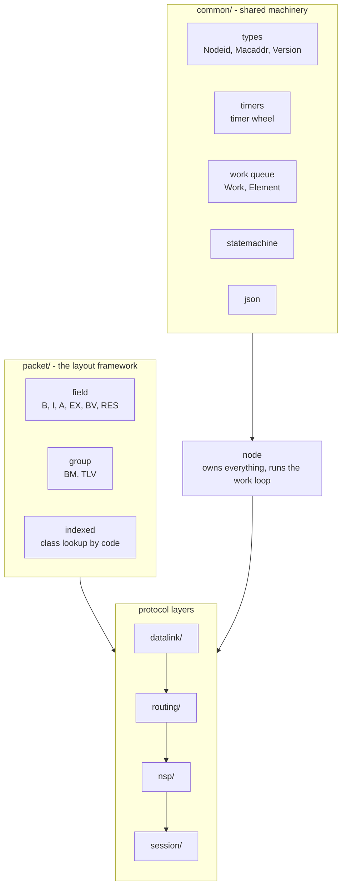
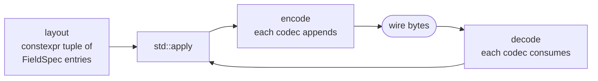
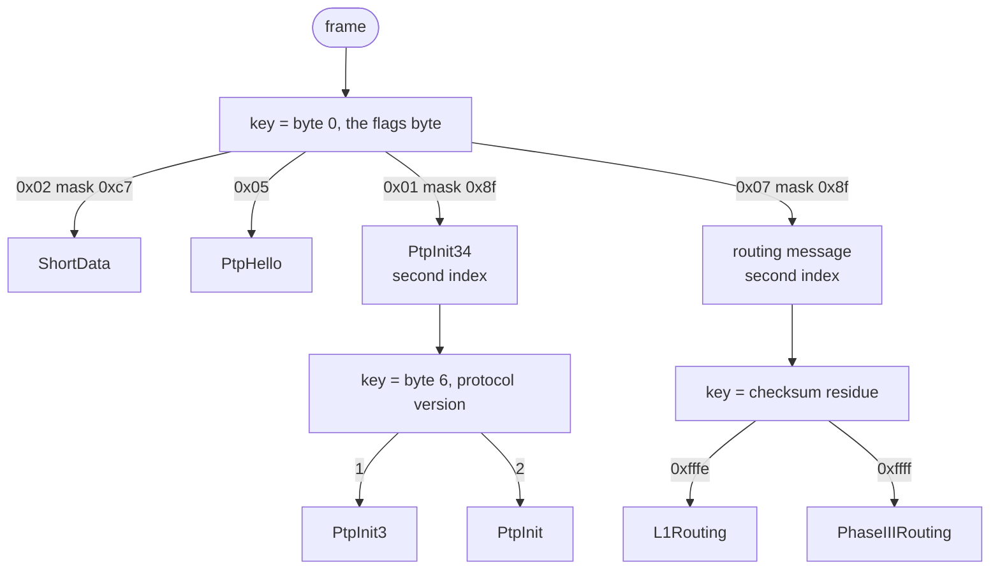
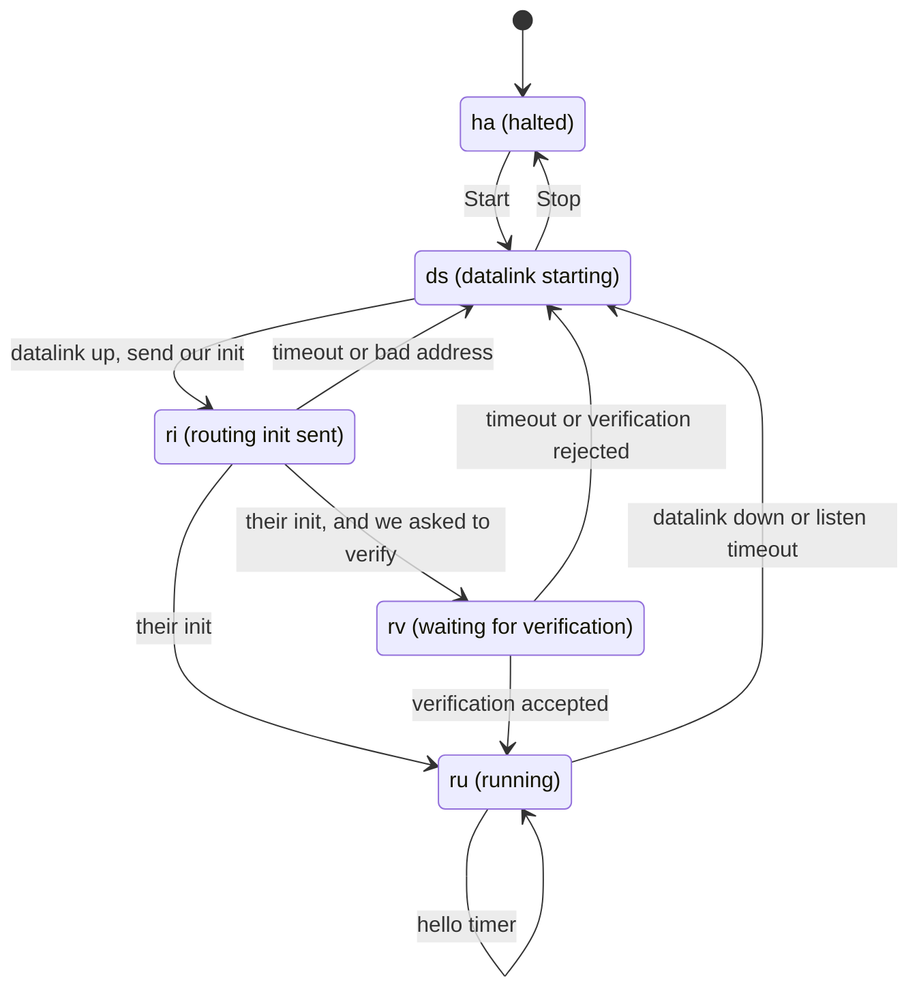
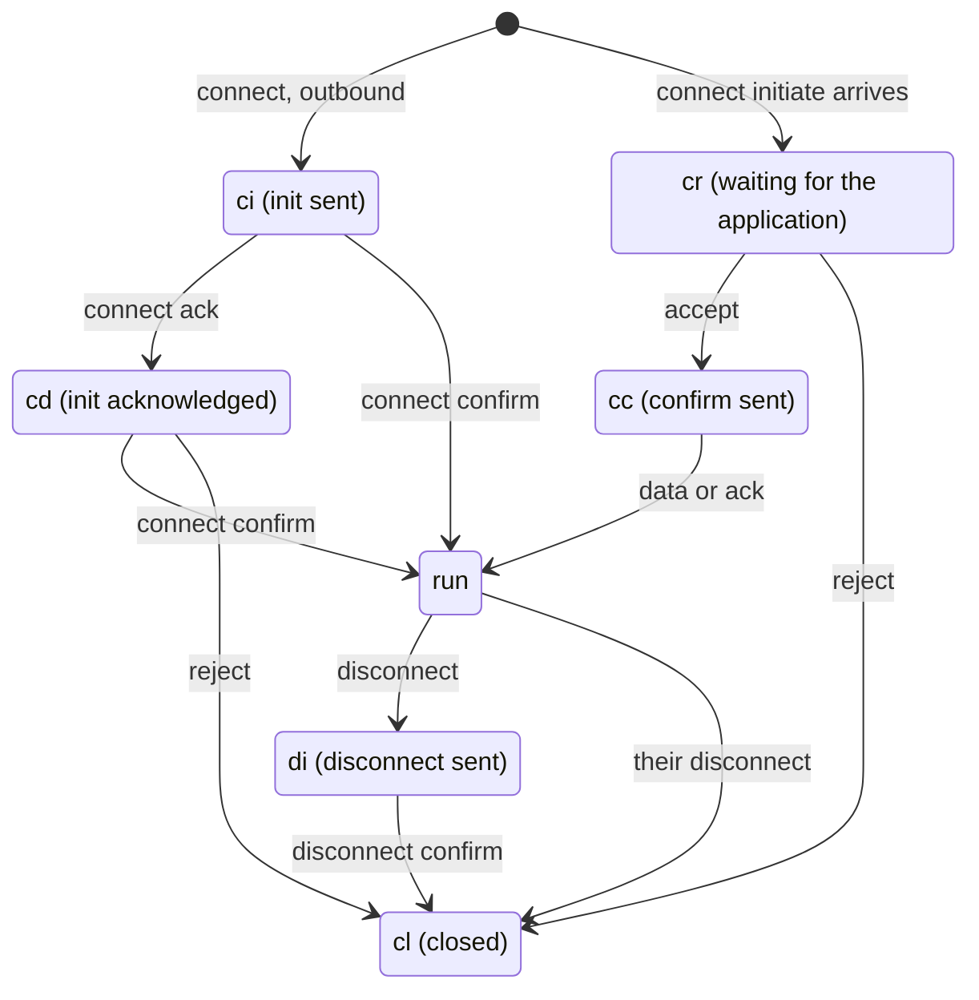
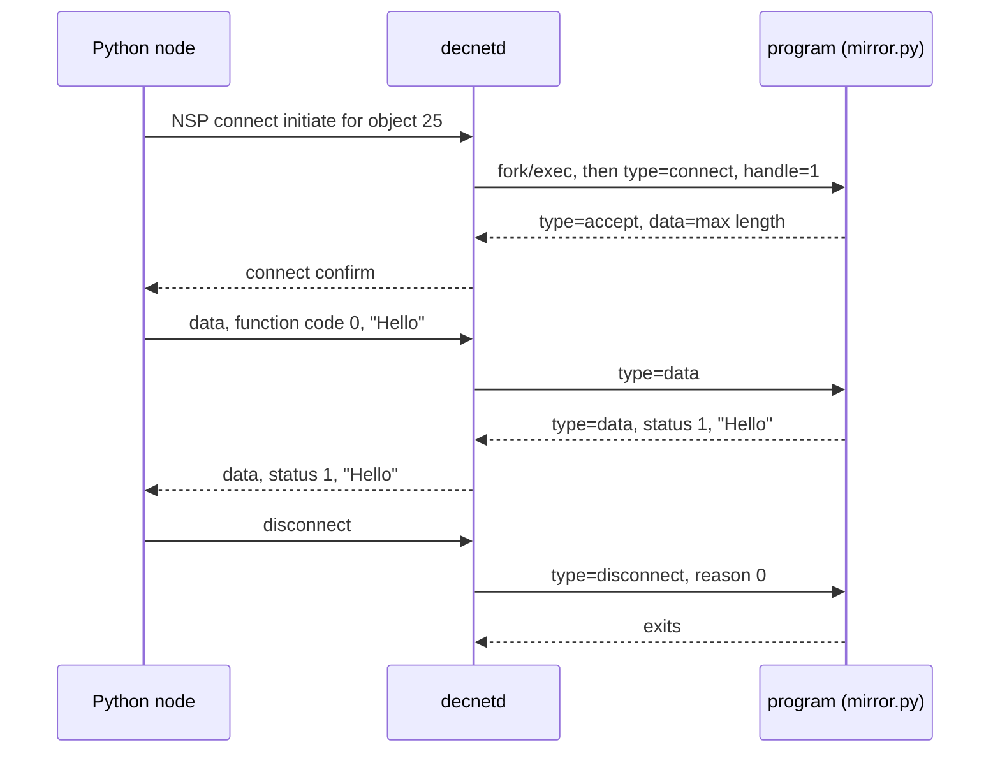

# Porting the Python to C++

Notes on how this port is put together. Mostly it records the handful of
places where C++ and Python differ enough that the decision is worth
writing down, so nobody has to work it out twice.

## Scope

The Python is about 27,000 lines implementing DECnet Phase II, III
and IV: data links, routing, NSP, session control, MOP, NICE, event logging
and an HTTP monitoring interface.

Out of scope: the network mapper (`mapper.py`, ~1,700 lines, plus the
bundled Leaflet assets). It is a HECnet-specific map server, upstream asks
people not to run more instances of it, and it has nothing to do with the
protocol stack. That leaves roughly 25,300 lines.

`dap.py` and `dap_packets.py` (the DAP file access listener, ~1,400 lines)
are in scope but last. FAL is not enabled by default upstream either.

## Why C++ and not C

The packet layouts. The Python describes them declaratively:

```python
_layout = (( packet.B, "srcnode", 2 ),
           ( packet.I, "name",   16 ))
```

A metaclass turns that into encode and decode methods when the class is
created. C++ templates do the same at compile time, with type checking and
nothing left to do at run time. In C you would either write encode and
decode by hand for all ~200 packet types, which is a lot of transcription
and a lot of places to make a mistake, or build a table-driven interpreter,
which is slower and untyped.

The rest follows from that choice. `std::span` replaces `memoryview` for
borrowed byte ranges. RAII replaces the garbage collector for socket and
thread lifetimes. Templates give `Mod<4096>` sequence arithmetic.

The build is GNU Make, non-recursive. No required dependencies; libpcap is
optional and probed for. Tests use a small harness in `tests/`, not a
framework.

## How it fits together



`Node` is the centre. It owns the work queue, the timer wheel and one
object per layer, and runs the loop that dispatches work items. Helper
threads do blocking I/O and post work back; nothing else touches layer
state from another thread.

## The five decisions that mattered

### 1. Packet layouts become templates

A Python layout row is a tuple of (field class, attribute name,
arguments). Here the field class is a template argument, the attribute name
a pointer to member, and the arguments template parameters:

```cpp
struct Simple : Packet<Simple> {
    std::uint8_t  code;
    std::uint16_t count;
    Bytes         name;
    Nodeid        src;

    static constexpr auto layout = fields (
        field<B<1>>        (&Simple::code,  "code"),
        field<B<2>>        (&Simple::count, "count"),
        field<I<16>>       (&Simple::name,  "name"),
        field<NodeidField> (&Simple::src,   "src"));
};
```

`encode` and `decode` are `std::apply` over that tuple, so the loop unrolls
and each codec inlines. Subclassing works the way the Python's does, through
`extend (Base::layout, ...)`.



Field types: `B`, `BV`, `I`, `A`, `EX`, `SIGNED`, `RES`, `Payload`, plus
`Nodeid`, `Macaddr` and `Version`, which know their own wire format. `BM`
packs named bit ranges into one integer. `TLV` handles tag/length/value
lists, using `std::optional` members where Python used `None` for absence.

### 2. Class lookup by code needs an explicit registry

Several packet families share a header, with a field in that header saying
which format this is. The Python registers each subclass in a class index
when the class is created. C++ has no equivalent hook, so registration is a
function call:

```cpp
DN_REGISTER_PACKET_MASKED (RoutingPacketBase, ShortData, 0x02, 0xc7);
```

Two properties of the Python mechanism are easy to miss and neither is
optional.

Masked registration: a class claims every key whose masked bits match.
Routing needs it because the flags byte mixes packet type with per-packet
bits. `routing_packets.py` uses it on fifteen classes.

Nested indexes: the class found by the first lookup can itself be the root
of a second index keyed on a different field.



The routing message case is the interesting one. Code point 0x07 is either
a Phase III message or a Phase IV level 1 message, and nothing in the
header says which. They are told apart by the checksum: the sum is seeded
with 1 for Phase IV and 0 for Phase III, so summing a valid message with
its checksum word complemented leaves 0xfffe or 0xffff. That residue is the
index key, which the nested lookup handles with no special casing.

### 3. The threading model stays as it is

One thread per node running a work item loop, with helper threads doing
blocking I/O and posting work back. `doc/internals.txt` explains why: it
makes the single-threaded reasoning in the DNA specifications carry over
directly to the implementation. Swapping it for a callback reactor would
throw that away for no gain, since the bottleneck here is never CPU.

The timer wheel's `revcount` mechanism is ported too, and it matters.
Expiry is noticed on the wheel's thread but delivered on the node's, so in
between a layer may have cancelled or restarted the very timer that is
firing. The count lets a stale timeout be dropped in one place instead of
in every layer.

### 4. Ownership replaces garbage collection

Work items are `unique_ptr`, moved into the queue. Adjacencies are
`shared_ptr`: a circuit, the routing table and in-flight work items all
refer to one at the same time, and this is where Python's collector was
doing real work. Parent and child layer links are raw pointers, since a
child never outlives its parent. Received packets are owned `Bytes` at the
queue boundary and `ByteView` only within one dispatch. A `ByteView` must
never be stored in a work item.

### 5. Decode errors stay exceptions, but never escape a receive path

`DecodeError` and its subclasses are ported as an exception hierarchy,
because that keeps the decoders readable. A malformed packet off the wire
must not unwind the node loop, so receive paths use `try_parse`, which
returns `std::optional`. The node loop catches at the top as a backstop.

## State machines

Two are worth drawing, being the parts most likely to be misread.

A point to point circuit brings up an adjacency by handshake:



There is deliberately no timeout in `ds`. The data link guarantees it will
keep trying and will report when it comes up, so a timeout here would only
let two layers fight each other. That is one of three deviations from the
spec that the Python documents, and all three are ported.

An NSP logical link:



This is smaller than the spec's state machine. The NSP spec models session
control as polling NSP for things it needs to hear, so it needs a state for
each "waiting to be polled". Here, as in the Python, session control is told
rather than polled, and each of those states collapses into the one that
followed it. The Python's comment lists them: O, DN, RJ, NC, NR, DRC, CN, DIC
and DR do not exist.

## Applications as separate programs

An object declared with `--file` is a program the daemon runs, talking to
it over three pipes.



This protocol is byte-compatible with the Python's, which was one of the
goals set when the port started: an application written for the Python works
here unchanged. It is verified by running the Python's own
`decnet/applications/mirror.py` as an object of this daemon and looping
through it with the Python's own `dnping`.

One detail mattered more than expected. The protocol tunnels arbitrary
bytes through JSON strings as latin-1, and NUL is not a corner case: the
mirror's "loop this back" function code is `0x00`, the first byte of every
request it receives. That rules out any JSON library whose string interface
is a NUL-terminated C string. cJSON was tried and truncates the value at
the first NUL, so it cannot carry this traffic. The parser in
`common/json.h` is about 200 lines and handles all 256 byte values, which a
test checks explicitly.

## Phases

Each phase is testable on its own, and each ports its Python unit tests
along with the code. The Python tests (13,700 lines) are the
specification. Where the Python behaviour and the DNA spec appear to
disagree, the Python is what interoperates, so follow it and leave a
comment.

| # | Phase | Python sources | ~lines |
|---|-------|----------------|--------|
| **0** | **Foundation** | `common`, `timers`, `statemachine`, `logging`, `config`, `node`, `crc`, `packet` (core) | ~2,000 |
| **1** | **Packet framework** | `packet` (BM/TLV/indexed), `modulo`, `nice_coding` (values) | ~1,600 |
| **2** | **Data links** | `datalink`, `multinet`, `ethernet`; `ddcmp`, `gre`, `pcap` remain | ~3,800 |
| **3** | **Routing** | `routing_packets`, `route_ptp`, `route_eth`, `routing`, `adjacency` | ~4,300 |
| **4** | **NSP** | `nsp_packets`, `nsp` | ~1,900 |
| **5** | **Session control** | `session`; some applications remain | ~2,000 |
| **6** | **MOP, events, NICE** | `mop` bar the console carrier, `events` and `event_logger` done; `nicepackets` remains | ~4,600 |
| 7 | Monitoring and API | `http`, `html`, `apiserver` | ~1,000 |
| 8 | Bridge, DAP/FAL | `bridge`, `dap`, `dap_packets` | ~1,700 |

Order follows dependencies, with one deliberate exception: phase 2 came
before phase 3, even though routing is the more interesting layer, because
a working Multinet link is what lets every later phase be tested against a
live Python node. That paid off repeatedly.

## Two traps

### Virtual calls during construction and destruction

This bit three times, in three disguises, and it is the most recurrent
hazard in porting this design.

`BaseRouter`'s constructor built its circuits, and a circuit asked the
router for its node type. During a base class constructor that call lands
on the pure virtual and aborts.

Moving the call into the circuit's own constructor fixed the crash but not
the problem. A circuit is created from the router's constructor, and for a
derived router that runs while the base part is still the most derived
class. So an area router announced itself on the wire as a level 1 router,
and every cross-area adjacency was rejected as an address out of range.
Nothing crashed; the node simply lied about itself.

`~Ethernet` called `close()`, which reaches the pure virtual
`stop_transport()` once the derived object is gone. Worse than the call
itself, the receive thread runs derived code, so stopping it in the base
destructor would already have been too late.

The rule that falls out: anything a constructor or destructor needs from
the object it is building or tearing down must be deferred to first use, or
done by the derived class.

### Static initialisers and static libraries

Packet classes register themselves into their family index. Doing that with
namespace-scope static initialisers does not work inside `libdecnet.a`. The
linker pulls in an archive member only when something already needed
references it, so a translation unit that exists purely to register classes
may never be linked at all, and its registrations never happen.

The symptom is a packet family that decodes correctly in one program and
not in another, depending on what else each happens to call. That is how it
turned up: one test binary passing and another failing on the same packets.

Registration is now explicit. `DN_PACKET_INDEX_REGISTERED` names a function
that performs the registrations, which both gives the linker the reference
it needs and runs it once before the first lookup.

## Testing

Five things, in rough order of how much they have caught.

End to end tests. Two nodes in one process, joined by a real circuit,
running the whole stack. Most of the interesting bugs were ordering
mistakes that only appear with real threads and real timers.

Sanitizers. ASan and UBSan on by default in debug. Python cannot corrupt
memory; this can. Both have found real bugs, including one in session
control that Python could not have had at all.

Wire format checks against bytes a real Python node produced. Cheap to
write, and worth more than any packet invented for the purpose.

Ported unit tests, module by module.

Live interop against a running Python node. Not automated, but run at
every milestone and recorded in the README.

## Next

NSP, MOP and event logging are done bar the parts noted in
[NOTDONE.md](NOTDONE.md). Next: the NICE protocol messages, then the
monitoring interfaces.
[TASKS.md](TASKS.md) has the detail, and [NOTDONE.md](NOTDONE.md) says what
is being left out and why.
