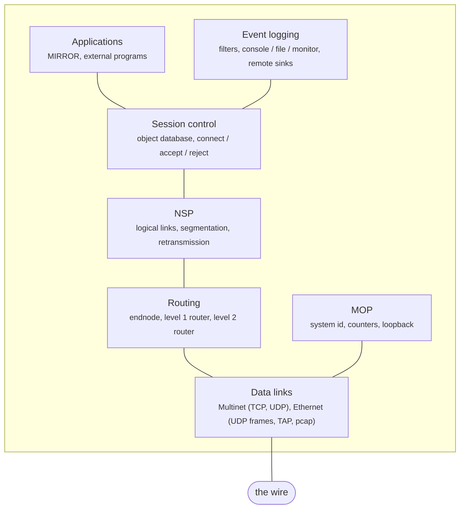

# cppdecnet

A C++ port of [PyDECnet](../pydecnet), Paul Koning's DECnet Phase II/III/IV
implementation.

Where the last session stopped, and what is unverified: [STATE.md](STATE.md).

Companion documents: [PORTING.md](PORTING.md) for how the port is
structured and why, [TASKS.md](TASKS.md) for what is left,
[NOTDONE.md](NOTDONE.md) for what was left out on purpose, and
[BUGS.md](BUGS.md) for defects found along the way.

## Where it stands

283 tests in 24 binaries. Builds clean in debug (with ASan and UBSan) and
release, no compiler warnings.



Everything in that diagram works. What is missing sits inside those boxes
rather than above or below them: MOP has no console carrier, NSP does not
ask for flow control on its own inbound data, session control carries
access control data but does not check it, the data link and physical
event classes are never raised, and the only data links are Multinet and
Ethernet. DDCMP, the HTTP and NICE monitoring interfaces, and Phase II and
Phase III neighbours are all still to do. [TASKS.md](TASKS.md) has the
list.

## Does it actually talk to anything?

Yes, and that is checked rather than assumed. Against a live PyDECnet
V1.1.1 node:

| | |
|---|---|
| Point to point | adjacency comes up, hellos accepted, circuit stays up |
| Level 1 routing | routes exchanged both ways; PyDECnet computes `Node 2, cost 4, hops 1 via MUL-0 1.2` from our advertisement |
| Level 2 routing | cross-area adjacency, both ends attached, both advertise as the way out |
| Ethernet | our circuit reads PyDECnet's LAN traffic: `RouterHello from 1.1 ntype=2 prio=64 blksize=591` |
| NSP + session | `NCP LOOP NODE` works in both directions |
| NSP flow control | segment and message modes obeyed, link service credit, XON/XOFF, `qmax` window |
| NSP interrupts | out of band data on its own subchannel, with credit |
| MOP | system id exchange, counters, loopback on a shared LAN |
| Event logging | records to a remote sink over a logical link, and back |

The loop test in full, since it exercises the whole stack:

```
# us -> PyDECnet's MIRROR
ECHO 6 bytes: 01 48 65 6c 6c 6f  "Hello"

# PyDECnet's own dnping -> our MIRROR
$ dnping 1.2
good reply
```

Applications written for PyDECnet run here unchanged. Objects that run as
separate programs use the same JSON-over-pipes protocol, so PyDECnet's own
`decnet/applications/mirror.py` can be named in our configuration and will
serve connections:

```
object --number 25 --name MIRROR --file .../decnet/applications/mirror.py
```

Two regression tests pin the wire formats down: the point to point init
message PyDECnet sends (`tests/test_indexed.cc`), and six NSP message types
encoded byte for byte against PyDECnet's output for the same values
(`tests/test_nsppacket.cc`).

## Building

C++20 (GCC 13+ or Clang 16+) and GNU Make. Nothing else is required.
libpcap is used if it is installed, which is what lets a circuit run on a
real Ethernet segment rather than a simulated one; `make features` says
whether it was found.

```sh
make                   # debug build with sanitizers, and the tests
make check             # build and run the tests
make BUILD=release     # optimised
make features          # what the build detected
make todo              # unfinished port sites
make help              # everything else
```

Output lands in `build/<flavour>/`:

```
build/debug/bin/decnetd      the daemon
build/debug/bin/dnping       command line tools
build/debug/lib/libdecnet.a  the stack as a library
```

## Running

Configuration files use PyDECnet's syntax unchanged.

```sh
./build/debug/bin/decnetd --log-level debug samples/endnode.conf
```

`samples/endnode.conf` is a Phase IV endnode. Point it at a PyDECnet node
listening on the same port and you should see:

```
circuit MUL-0 up, neighbour 1.1 (Endnode), block size 576
```

`samples/multinet.conf` and `samples/ethernet.conf` drive the data links on
their own, `samples/pcap.conf` puts a circuit on a real Ethernet segment,
and `samples/pydecnet.conf` is an unmodified upstream sample.
Configuration commands for layers that are not ported yet get parsed and
kept rather than rejected, so a real file loads.

## Layout

```
include/decnet/     public headers, mirroring src/
  common/           types, logging, timers, work queue, state machine, CRC, JSON
  packet/           the layout framework
  datalink/         datalink layer, Multinet, Ethernet
  routing/          packets, adjacencies, circuits, routers
  nsp/ session/     transport and above
  mop/              maintenance protocol: system id, counters, loopback
  nice/             NICE data values, entities and parameter lists
  events/           event records, filters and sinks
src/                implementations
tools/              command line tools, one binary per .cc
tests/              one binary per test_*.cc
mk/                 build fragments
samples/            configuration files
```

Each module names the PyDECnet module it came from in its header comment.
Incomplete spots are marked `PORT:` with the reason; `make todo` lists them.

## Testing

`make check` runs the lot. Three kinds of test:

Unit tests ported alongside each module. The PyDECnet test suite is the
specification here.

Wire format checks against bytes a real PyDECnet node produced. A format we
only agree with ourselves about is not worth much.

End to end tests that stand two nodes up in one process, joined by a real
TCP or UDP circuit, and run the whole stack. These catch the ordering
mistakes that unit tests cannot see.

Debug builds run under ASan and UBSan. Python could not corrupt memory;
this can, and the receive paths parsing untrusted input are where it would
happen. Both have already paid for themselves — see [BUGS.md](BUGS.md).

## Licence

PyDECnet is BSD 3-clause and this port carries the same terms. See
[LICENSE](LICENSE).

"DECnet" may be a trademark. Digital and its successors have no involvement
in this implementation.
