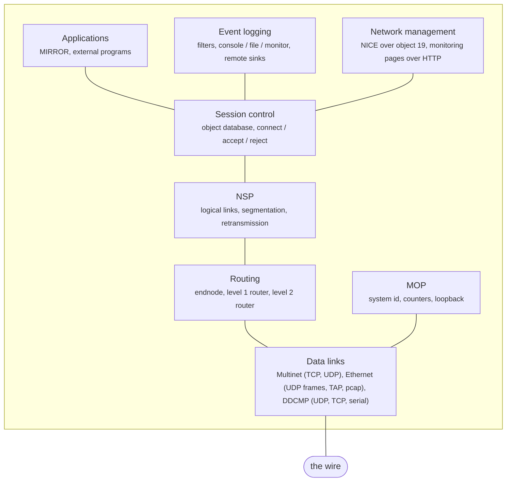

# cppdecnet

DECnet Phase II/III/IV in C++.

A shameless port of the Python.



Everything in the diagram works. What is missing sits inside those boxes
rather than above or below them:

- MOP has no console carrier
- NSP does not ask for flow control on its own inbound data
- session control carries access control data but does not check it
- the data link and physical event classes are never raised
- DDCMP has everything but its synchronous framer, and has not yet run
  against anything other than itself
- network management is read only: NICE serves READ INFORMATION and
  LOOP NODE, and refuses SET and ZERO

Phase II and Phase III neighbours, the JSON API over a Unix socket, the
bridge and the DAP file access listener are still to do.

Other documents: [STATE.md](STATE.md) where work stopped and what is
unverified, [PORTING.md](PORTING.md) how the port is structured,
[TASKS.md](TASKS.md) what is left, [NOTDONE.md](NOTDONE.md) what was left
out on purpose, [BUGS.md](BUGS.md) defects found along the way.

## Does it actually talk to anything?

Yes, and that is checked rather than assumed. Against a live Python
V1.1.1 node:

| | |
|---|---|
| Point to point | adjacency comes up, hellos accepted, circuit stays up |
| Level 1 routing | routes exchanged both ways; the Python computes `Node 2, cost 4, hops 1 via MUL-0 1.2` from our advertisement |
| Level 2 routing | cross-area adjacency, both ends attached, both advertise as the way out |
| Ethernet | our circuit reads the Python's LAN traffic: `RouterHello from 1.1 ntype=2 prio=64 blksize=591` |
| NSP + session | `NCP LOOP NODE` works in both directions |
| NSP flow control | segment and message modes obeyed, link service credit, XON/XOFF, `qmax` window |
| NSP interrupts | out of band data on its own subchannel, with credit |
| MOP | system id exchange, counters, loopback on a shared LAN |
| Event logging | records to a remote sink over a logical link, and back |
| Real hardware | a PDP-11 running RSX (BAJI, 1.19) on a pcap circuit: we elect ourselves designated router, it adopts us and says so in its own hellos, `rtr 1.20` |

The loop test in full, since it exercises the whole stack:

```
# us -> the Python's MIRROR
ECHO 6 bytes: 01 48 65 6c 6c 6f  "Hello"

# the Python's own dnping -> our MIRROR
$ dnping 1.2
good reply
```

Applications written for the Python run here unchanged. Objects that run as
separate programs use the same JSON-over-pipes protocol, so the Python's own
`decnet/applications/mirror.py` can be named in our configuration and will
serve connections:

```
object --number 25 --name MIRROR --file .../decnet/applications/mirror.py
```

Two regression tests pin the wire formats down: the point to point init
message the Python sends (`tests/test_indexed.cc`), and six NSP message types
encoded byte for byte against the Python's output for the same values
(`tests/test_nsppacket.cc`).

## Building

C++20 (GCC 13+ or Clang 16+) and GNU Make. Nothing else is required.
libpcap is used if it is installed, which is what lets a circuit run on a
real Ethernet segment rather than a simulated one; `make features` says
whether it was found.

```sh
make                   # optimised build, and the tests
make check             # build and run the tests
make BUILD=debug       # unoptimised, with ASan and UBSan
make features          # what the build detected
make todo              # unfinished port sites
make help              # everything else
```

Output lands in `build/<flavour>/`:

```
build/release/bin/decnetd      the daemon
build/release/bin/dnping       command line tools
build/release/lib/libdecnet.a  the stack as a library
```

## Running

Configuration files use the Python's syntax unchanged.

```sh
./build/release/bin/decnetd --log-level debug samples/endnode.conf
```

```
  -L, --log-level LEVEL   trace, debug, info, warning, error
  -e, --log-file FILE     log to FILE instead of stderr
  -V, --version           print the version and exit
  -h, --help              print this message
```

`samples/endnode.conf` is a Phase IV endnode. Point it at a Python node
listening on the same port and you should see:

```
circuit MUL-0 up, neighbour 1.1 (Endnode), block size 576
```

Configuration commands for layers that are not ported yet get parsed and
kept rather than rejected, so a real file loads.

## Connecting to other nodes

A circuit line names the circuit, the kind of data link, and the device
string that says where it goes:

```
circuit <name> <Multinet|Ethernet|DDCMP> <device> [options]
```

There are five device forms, and choosing between them is mostly a question
of what is on the other end and how much privilege you are willing to give
the daemon.

| Device | Looks like | Needs root | Reaches |
|---|---|---|---|
| `Multinet <host>:<port>:connect` / `:listen` | a point to point wire | no | one other host, anywhere IP goes |
| `Multinet <host>:<port>` | the same, over UDP | no | same, but see the warning below |
| `Ethernet udp:<lp>:<host>:<rp>` | a two station LAN | no | one other host, anywhere IP goes |
| `Ethernet tap:<dev>` | a real LAN | yes (or a preconfigured device) | whatever the tap is bridged to |
| `Ethernet pcap:<iface>` | a real LAN | yes (`CAP_NET_RAW`) | real hardware on a real segment |
| `DDCMP udp:<lp>:<host>:<rp>` | a synchronous line | no | one other host, with DDCMP doing the work IP would otherwise do |
| `DDCMP tcp:<lp>:<host>:<rp>` | the same, over a stream | no | one other host; what SIMH speaks |
| `DDCMP serial:<dev>[:<speed>]` | a real serial line | no (group `dialout`) | whatever is on the other end of the cable |

Options common to all of them: `--cost`, `--t1`, `--t3` (hello interval),
`--mop` to enable the maintenance protocol on the circuit. Broadcast
circuits also take `--priority` and `--nr` for designated router election,
and `--random-address`.

### Multinet — a point to point circuit over IP

Multinet wraps DECnet routing packets in a four byte header and carries
them over TCP. The two ends are not symmetric: one connects and one
listens, and the device string says which you are.

```
# we open the connection
circuit mul-0 Multinet 192.168.1.50:700:connect --t3 15

# we wait for one
circuit mul-0 Multinet :700:listen
```

The port defaults to 700 if you leave it out. In `listen` mode the port in
the device string is the one we bind; the host part is ignored, so a bare
`:700:listen` is the usual spelling.

This is the easiest way to reach another node, and it is what the sample
configurations use. `samples/endnode.conf` and `samples/multinet.conf` are
both Multinet, with the matching Python configuration written out in a
comment so you can stand both ends up.

Multinet is a point to point data link, so the circuit forms exactly one
adjacency, with whoever is at the other end. There is no designated router
election and no MAC addressing involved.

### Multinet over UDP

Drop the `:connect` or `:listen` and the circuit runs over UDP instead:

```
circuit mul-1 Multinet 192.168.1.50:17701
circuit mul-1 Multinet 192.168.1.50:17701:17702    # different local port
```

Both ports are the same unless you give a second one. It works, and
decnetd will start it, but it logs a warning when it does — UDP Multinet
violates the DECnet architecture, because a data link is supposed to
deliver packets in order or not at all, and UDP promises neither. Routing
above it will mistake reordering for loss. Use TCP unless something at the
far end can only do UDP.

### DDCMP — the protocol a real synchronous line used

Multinet and Ethernet both lean on what carries them: IP delivers the
bytes, in order, or says it could not. DDCMP assumes none of that. It was
written for a modem and a piece of wire, so it does its own framing, its
own sequence numbers, its own acknowledgement and its own retransmission.

That makes it the one data link here that is a protocol rather than a
frame format, and the one worth having if you ever want to reach a real
DEC machine over a serial line rather than over Ethernet.

```
# over UDP, each end naming its own port and the other's
circuit ddc-0 DDCMP udp:27801:192.168.1.50:27802 --t3 10

# over TCP, which is what SIMH speaks
circuit ddc-0 DDCMP tcp:27801:192.168.1.50:27802 --t3 10
```

The two differ only in what they have to do about framing. One datagram is
exactly one DDCMP message, so over UDP there is nothing to frame and a lost
datagram is simply a lost message, which the protocol already expects. A
TCP connection is a byte stream with no message boundaries in it, so the
receiver slides along the stream a byte at a time until eight of them pass
the header CRC. That is the only thing worth trusting: after a loss of
sync, a length field would have come out of the noise that caused it.

Over TCP both ends listen and dial at the same time and the first
connection to arrive is the one used, so neither end has to be told which
it is. SIMH does the same, in `sim_tmxr.c`.

`telnet:` is TCP with the all-ones byte doubled, for reaching a SIMH
terminal port that is not in raw mode.

```
# a real serial line, which is the medium DDCMP was written for
circuit ser-0 DDCMP serial:/dev/ttyUSB0:38400 --t3 10
```

The line is set raw, 8 bits, no parity, one stop bit, and no flow control
of any kind. DDCMP does its own framing and its own error detection, so
anything the line discipline might helpfully do to the bytes is damage.
Each frame is followed by one all-ones byte, as the spec says; no SYN bytes
go in front, because those are for synchronous lines and the spec says not
to send them on an async one.

This is the transport where nothing underneath does any of the work -- no
connection to establish, no delivery guarantee, no ordering beyond the
order bits arrive in. It is what makes the protocol's framing, sequencing
and retransmission worth having rather than redundant.

### Ethernet over UDP — a LAN with two stations on it

Here each UDP datagram carries one whole Ethernet frame, so what the stack
above sees is a broadcast circuit rather than a wire: hellos are
multicast, there is a designated router election, neighbours are addressed
by MAC. Two nodes pointed at each other are a degenerate LAN with two
stations on it.

```
# local port : peer host : peer port
circuit eth-0 Ethernet udp:17802:127.0.0.1:17801 --random-address
```

The matching end reverses the ports:

```
circuit eth-0 Ethernet udp:17801:127.0.0.1:17802 --random-address
```

`--random-address` gives the circuit a locally administered MAC, which is
what you want when several nodes run on one host and would otherwise
collide. The Python spells this API `bridge` as well as `udp`; both are
accepted and mean the same thing.

This is the one to use for testing anything that needs LAN behaviour —
router election, endnode adjacencies, MOP — without needing privilege or a
real segment. `samples/ethernet.conf` is a worked example.

### TAP — a kernel Ethernet device

A tap device is a real interface as far as the kernel is concerned, so the
circuit can be bridged, captured, firewalled and routed like any other:

```
circuit eth-0 Ethernet tap:tap0
circuit eth-0 Ethernet tap:/dev/tap0     # a path works too, we take the basename
```

Linux only. The device has to exist already and the daemon has to be able
to open `/dev/net/tun` and attach to it, which means root, or a tap created
in advance with `ip tuntap add ... user <you>`. Create one like this:

```sh
sudo ip tuntap add dev tap0 mode tap user $USER
sudo ip link set tap0 up
```

Where tap earns its place is in front of an emulator. SIMH and friends can
attach to the same tap or to a bridge containing it, which puts an emulated
VAX or PDP-11 on the same LAN as decnetd without either one touching
physical hardware.

Unlike pcap, tap frames come to us because the kernel hands them over, so
there is no promiscuous capture and no source address trickery — this
interface really is ours.

### pcap — a real Ethernet segment

This is the one that reaches real hardware.

```
circuit eth-0 Ethernet pcap:enx00051be19c68 --t3 10 --mop
```

`samples/pcap.conf` (endnode) and `samples/pcap-router.conf` (level 1
router) are both set up for this, and the comments in them are worth
reading before you start. Four things to know:

**Privilege.** Capturing and injecting frames needs `CAP_NET_RAW`. Either
run the daemon as root, or grant the capability once:

```sh
sudo setcap cap_net_raw,cap_net_admin+eip build/release/bin/decnetd
```

That needs the default release build — a sanitizer instrumented binary
(`make BUILD=debug`) refuses to run with elevated privileges.

**The hardware address.** DECnet Phase IV derives a station's Ethernet
address from its node number: node 1.20 is `aa-00-04-00-14-04`. We cannot
reprogram the interface to match, so the circuit transmits frames whose
source is the derived address while the card keeps its own, and captures
promiscuously to see the replies. That works on a switched segment. It does
not work on wifi — a managed mode station cannot transmit with a source
address that is not its own.

**Pick a free node number.** Two nodes claiming one address is worse than
not being on the segment at all. `tools/pcap-survey.sh` listens on an
interface for a while and tells you which Phase IV stations it heard, which
are routers and which are endnodes, and whether the address you plan to
claim is already taken. It captures and never transmits, so it cannot
disturb anything:

```sh
sudo ./tools/pcap-survey.sh enx00051be19c68 90
```

**Start with MOP.** `--mop` enables system id announcements, counters
requests and loopback on the circuit. Those need a working frame path and
nothing else — no routing adjacency, no matching node type — so a real DEC
machine answering them is the cleanest first sign that the wire is good.

One thing the samples point out and that is easy to lose an evening to: an
endnode will not form an adjacency with another endnode. If the only other
station on the segment is an endnode with no designated router, run as a
level 1 router (`pcap-router.conf`) or nothing will come up, and that is
correct behaviour rather than a fault.

### A gateway: pcap on one side, Multinet on the other

A node can have circuits of different kinds. A level 1 router with a pcap
circuit and a Multinet circuit joins a real Ethernet segment to a node out
on the internet: the hardware on the segment speaks DECnet over Ethernet
and knows nothing about IP, the far end is reached over TCP and knows
nothing about the segment.

```
  [ PDP-11 1.19 ]---+
                    |  real Ethernet segment
  [ VAX 1.21 ]------+
                    |
               [ us, 1.20 ]  ETH-0 pcap / MUL-0 Multinet
                    |
                    |  TCP to 11.22.33.44:9999
                    |
               [ peer 1.10 ]
```

`samples/l1-gateway.conf` is that, in full. The two circuit lines are the
whole of it:

```
routing 1.20 --type l1router

node 1.20 CPPGW        # us
node 1.19 BAJI         # on the local segment
node 1.10 FARSID       # the far end of the Multinet circuit

circuit eth-0 Ethernet pcap:enx00051be19c68 --t3 10 --priority 64 --mop
circuit mul-0 Multinet 11.22.33.44:9999:connect --t3 15 --cost 10
```

and the far end answers with:

```
routing 1.10 --type l1router
node 1.10 FARSID
node 1.20 CPPGW
circuit mul-0 Multinet :9999:listen --t3 15 --cost 10
```

One end connects and the other listens — swap the two lines if it is the
far end that dials out. Outbound TCP to 9999 has to be allowed, and if you
are the listening end instead then 9999 has to be open inbound and
forwarded to the host running decnetd.

Three choices in there are worth explaining:

**`--type l1router`, and the area it implies.** A level 1 router routes
within one area. Every node above is in area 1, which is what makes this
work at all. If the Multinet peer is in a different area a level 1 router
will not carry traffic to it — out of area packets go to the nearest level
2 router and there will not be one. Use `--type l2router` in that case;
nothing else in the file changes.

**`--cost 10` on the long circuit**, against the LAN's default of 4. Cost
is how routing picks between two ways to the same place, and a TCP circuit
over the public internet should lose that comparison to a local segment.

**`--t3 15` on the long circuit and 10 on the LAN.** The hello interval,
and so how quickly a circuit is declared down. A round trip across the
internet deserves more slack than one across a switch.

What success looks like is one adjacency per circuit:

```
Event type 4.15, Adjacency up
From node 1.20 (CPPGW), occurred 11-Sep-2026 07:19:34.197
    Circuit = ETH-0, Adjacent node = 1.19 (BAJI)
circuit MUL-0 up, neighbour 1.10 (L1Router), block size 576
```

After which the routing tables merge and each side learns the other's
nodes. The end to end test is a loop from one far side to the other,
through the gateway and across both circuits — `NCP> LOOP NODE BAJI` run
on FARSID. If both adjacencies come up but that does not work, the two
halves are fine and the routing between them is not, and `--log-level
debug` shows the routing messages on each circuit.

## Monitoring

Two ways to ask a running node what it is doing, and they answer from the
same place.

`NCP` over the network. Object 19 is the network management listener, so a
management station -- the Python's `ncp`, or the NCP on a real VMS or RSX
node -- can read this node's database:

```
NCP> TELL CPPNOD SHOW KNOWN CIRCUITS
NCP> TELL CPPNOD SHOW EXECUTOR CHARACTERISTICS
```

READ INFORMATION is served for every entity at all four levels of detail,
and `LOOP NODE` loops through MIRROR.

Writes are refused, and the two are refused differently because NCP prints
the reason. SET answers "unrecognized function", which is what the Python
answers -- it does not implement SET either. ZERO COUNTERS answers
"privilege violation": the Python implements it and refuses it that way when
it is read-only, which is our permanent posture, because the user name,
password and account a request carries are not authenticated.
See [NOTDONE.md](NOTDONE.md).

### The web pages

A configuration line turns them on. The port is how the feature is enabled:
leave it out and no server runs.

```
http --http-port 8102
```

```
http://localhost:8102/
```

The index names the node and links to the rest:

```
Node             1.20 (CPPNOD)
Identification   DECnet/C++ V0.1.0
Software         DECnet/C++ V0.1.0
```

One page per entity, the same six NCP knows about:

| Page | Shows |
|---|---|
| `/nodes` | every node in the database, the executor first |
| `/circuits` | the circuits, one block per adjacency |
| `/lines` | the data links under the circuits |
| `/areas` | the areas an area router can reach |
| `/modules` | configuration modules |
| `/logging` | the event sinks and what they are filtering |

Each takes an `info` parameter, which is the same choice NCP offers after
`SHOW`: `summary` (the default), `status`, `char` for characteristics, and
`counters`.

```
http://localhost:8102/nodes
http://localhost:8102/circuits?info=counters
```

```
Node = 1.20 (CPPNOD)
    State            On
    Identification   DECnet/C++ V0.1.0

Node = 1.1 (GATE)
    State            Unreachable

1020 unreachable nodes not shown - show every node
```

`SHOW KNOWN NODES` on a router means every address in its routing table,
which is a thousand rows of "Unreachable" around the few that mean
something. The page shows the executor, anything with a name and anything
with something to say, and offers the rest behind a link rather than
deciding for you:

```
http://localhost:8102/nodes?all=1
```

```
Circuit = MUL-0
    Bytes received        0
    Bytes sent            0
    Data blocks received  0
    Data blocks sent      0
```

The pages are built from the same `nice_read` the NICE protocol answers,
rather than a second set of accessors into each layer. One description of
what a circuit looks like, not two that drift apart -- and nothing can
appear on a page that a remote NCP could not also read.

They are read only. There is no form, no button and no request that changes
anything, which is the same posture as the NICE listener above.

Two things to know before putting this on a network. The server **listens
on every interface**, not just the loopback, and there is **no
authentication**: anyone who can reach the port can read the node's
database. That is what the Python's monitoring does too, and it is fine on a
private segment and wrong on a public one. Bind it behind whatever you
already trust, or leave the line out.

HTTPS is not offered. `--https-port` is accepted and ignored so that a real
a real Python configuration file still loads. The pages the Python has that these
do not -- per-connection NSP detail, the event display, the bridge page --
are listed in [TASKS.md](TASKS.md).

## Layout

```
include/decnet/     public headers, mirroring src/
  common/           types, logging, timers, work queue, state machine, CRC, JSON
  packet/           the layout framework
  datalink/         datalink layer, Multinet, Ethernet, DDCMP
  routing/          packets, adjacencies, circuits, routers
  nsp/ session/     transport and above
  mop/              maintenance protocol: system id, counters, loopback
  nice/             NICE values, entities, parameters, messages, the NML object
  events/           event records, filters and sinks
  http/             the monitoring pages
src/                implementations
tools/              command line tools, one binary per .cc
tests/              one binary per test_*.cc
mk/                 build fragments
samples/            configuration files
```

Each module names the Python module it came from in its header comment.
Incomplete spots are marked `PORT:` with the reason; `make todo` lists them.

## Testing

`make check` runs the lot: 354 tests in 27 binaries. Note that `BUILD`
defaults to **release**, so a plain `make check` is the optimised build and
`make check BUILD=debug` is the sanitizer one. Running a binary by hand out
of `build/debug/bin` after a plain `make` runs whatever was there last,
which is a convincing way to debug a failure that no longer exists.

Four kinds of test:

Unit tests ported alongside each module. The Python test suite is the
specification here.

Wire format checks against bytes a real Python node produced. A format we
only agree with ourselves about is not worth much.

End to end tests that stand two nodes up in one process, joined by a real
TCP or UDP circuit, and run the whole stack. These catch the ordering
mistakes that unit tests cannot see.

Protocol engines run against each other with no transport underneath.
DDCMP is tested this way: two engines, a vector for a wire, and a message
is lost by not delivering it. The startup handshake, a NAK, a REP, a full
window and three hundred messages through the sequence number wrap are all
straight line tests with no sockets, no threads and no timers in them.

`make BUILD=debug` builds under ASan and UBSan. Python could not corrupt
memory; this can, and the receive paths parsing untrusted input are where
it would happen. Both have already paid for themselves — see [BUGS.md](BUGS.md).

## Licence

This port is copyright its author and BSD 3-clause. The Python it was
ported from is Paul Koning's, also BSD 3-clause, and its copyright notice
is retained in [LICENSE](LICENSE) as those terms require.

Credit where it is due: the protocol work here was worked out in that
Python first, and this port would not exist without it.

"DECnet" may be a trademark. Digital and its successors have no involvement
in this implementation.
