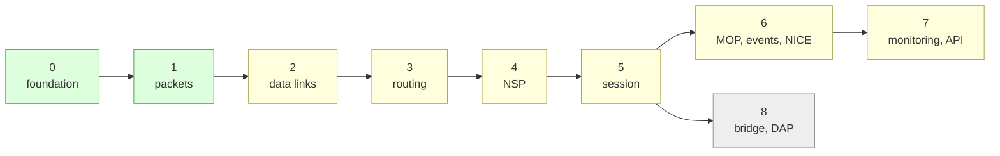

# What is left

The remaining work, ordered so each step can be tested against a live
Python node. [PORTING.md](PORTING.md) says why the order is what it is;
this is the checklist.

Two neighbours: [BUGS.md](BUGS.md) has defects rather than unwritten work,
and [NOTDONE.md](NOTDONE.md) has the things left out on purpose, with the
reasoning. Anything listed there is a decision, not an oversight.

Unfinished spots in the code carry a `PORT:` comment; `make todo` lists
them.

Done so far: 48 library sources, 357 tests in 27 binaries, clean under ASan
and UBSan and at `-Wall -Wextra -Wpedantic` plus a dozen more.

Green is finished, yellow is working but incomplete, grey is untouched.

---

## Done

### Phase 0, foundation
- [x] Build system: non-recursive GNU Make, debug/release/coverage, no
      required dependencies, libpcap probed for
- [x] `common/types`: `Nodeid`, `Macaddr`, `Version`, name validation
- [x] `common/logging`: levels including TRACE, deferred formatting
- [x] `common/timers`: the timer wheel, including the `revcount` guard
      against a timeout racing a cancel
- [x] `common/work`, `common/element`: work queue and layer base
- [x] `common/statemachine`: states as named pointers to member
- [x] `common/crc`: CRC-16, CRC-CCITT, CRC-32 as constexpr tables
- [x] `common/json`: enough JSON for the application protocol
- [x] `node`: the container and its main loop
- [x] `config`: the Python's configuration syntax, `@file` includes
- [x] Test harness

### Phase 1, packet framework
- [x] `packet/field`: `B`, `BV`, `I`, `A`, `EX`, `SIGNED`, `RES`,
      `Payload`, and the self-coding `Nodeid`/`Macaddr`/`Version`
- [x] `packet/packet`: layouts as constexpr tuples, layout inheritance
- [x] `packet/group`: `BM` bitmaps and `TLV`, including nested bitmaps
      inside TLV items, wild tags and tolerant mode
- [x] `packet/indexed`: class lookup by code, with masked registration,
      nested index levels and default classes
- [x] `common/modulo`: RFC 1982 sequence arithmetic
- [x] `nice/value`: NICE data values (DU, DS, H, O, AI, HI, C, CM)

### Phase 2, data links
- [x] `datalink/datalink`: the layer, `Datalink`, `Port`, work items
- [x] `datalink/ptp`: point to point state machine and receive thread
- [x] `datalink/multinet`: TCP connect, TCP listen, UDP
- [x] `datalink/bc`: broadcast datalink: DEC Ethernet framing, per
      protocol type ports, address filtering
- [x] `datalink/ethernet`: frames in UDP datagrams, and TAP devices
- [x] `common/socket`, `common/backoff`

### Phase 3, routing
- [x] `routing/packets`: data and control packets, LAN hellos, routing
      messages with segments and the one's complement checksum
- [x] `routing/circuit`: the common base that lets one `Adjacency` and one
      update process serve both circuit kinds
- [x] `routing/ptp`: the `ha`/`ds`/`ri`/`rv`/`ru` circuit state machine
- [x] `routing/lan`: LAN hellos, two-way confirmation, designated router
      election, the endnode previous hop cache
- [x] `routing/adjacency`: adjacency, listen timer, self adjacency
- [x] `routing/routing`: `BaseRouter` and `EndnodeRouting`
- [x] `routing/l1router`: routing matrix, route computation, forwarding
      with visit limit and return to sender, the update process
- [x] `L2Router`: area matrix, attached flag, out of area forwarding

### Phase 4, NSP
- [x] `nsp/packets`: every message type, checked byte for byte against
      The Python's output for the same values
- [x] `nsp/nsp`: link addresses, the connection state machine,
      segmentation and reassembly, retransmission with a retry limit
- [x] Outbound flow control: segment and message modes, link service
      messages, XON/XOFF, and a `qmax` window
- [x] Out of order segments held and delivered when the gap fills
- [x] The interrupt subchannel, with its own sequence space and credit,
      and acknowledgements routed to the right subchannel

### Phase 5, session control
- [x] `session/packets`: the connect message: end users by number, name or
      name and UIC, flags, access control and connect data
- [x] `session/session`: object database, connect/accept/reject, the
      application interface
- [x] `session/process`: objects that run as separate programs, over a
      protocol byte-compatible with the Python's
- [x] `mirror`: object 25, NCP LOOP NODE, working in both directions
- [x] `object` configuration lines, which override a built-in of the same
      number or name

---

## Next

### NSP: what is left
Outbound flow control is done. A peer that asks for segment or message mode
is obeyed, link service messages carry credit, XON and XOFF work, and a
window of `qmax` segments applies whatever the mode. Segments arriving
ahead of their turn are held rather than dropped.

- [ ] Ask for flow control on our own inbound data, which means sending
      link service messages as a receiver. The Python asks for `SVC_NONE`
      too, so this is a gap rather than an incompatibility
- [ ] Offer interrupt credit to the far end, so a peer that waits for it
      is not stuck. The Python has the same gap
- [ ] Delayed acknowledgement: the `dly` flag and the holdoff timer, which
      cut the number of bare acknowledgements on a busy link
- [ ] Phase II connections, which have no connect acknowledgement

### Session control: the rest
- [ ] Access control is carried but not checked; the Python uses PAM
- [ ] Run an object as a different user, as the Python does with a uid and
      gid set before exec
- [ ] Outbound connections from an application, and the `bind` request the
      API server uses
- [x] `nml` (19) and `evl` (26), two of the three objects the Python enables
      by default
- [ ] `pmr` (123), the poor man's routing relay, which is the third
- [ ] Finish `tools/dnping`, which can now be written against session
      control

### Routing: the gaps
- [ ] Phase III neighbours: answer a `PtpInit3` with our own, carry 8-bit
      addresses, supply the home area on packets from a Phase III
      neighbour. `src/routing/ptp.cc`, the `ri` state
- [ ] `Phase3EndnodeRouting` and `Phase3Router`
- [ ] Phase II: `NodeInit` and `NodeVerify` formats, routing by name, the
      `ru2` running state, and `intercept.py`
- [ ] The LAN router table overflow case (`--nr`) and its `adj_rej` event
- [ ] Endnode hello `testdata` is not checked on receipt, as it is on a
      point to point circuit

### Data links: what is left
- [x] DDCMP message framing: the three start bytes, the eight byte header
      with its own CRC, data and maintenance messages, the five control
      messages, and the header-CRC resynchronisation a receiver uses after
      an error. Checked byte for byte against the Python's own encoder
- [x] DDCMP protocol: the startup handshake, sequence numbers,
      acknowledgement, the REP/NAK exchange, retransmission, the send
      window and maintenance mode. Transport independent, and tested by
      running two engines against each other
- [x] The UDP transport, where one datagram is exactly one message, and
      the device string `udp:lport:host:rport`
- [x] Wired into the circuit factory: `circuit ddc-0 DDCMP udp:...` works,
      and two nodes bring a routing adjacency up over it
- [x] The TCP and telnet transports. Both ends listen and dial at once and
      the first connection wins, as SIMH's sim_tmxr does, so neither end
      has to be told which it is. The stream is framed by sliding along it
      until eight bytes pass the header CRC; telnet doubles the all-ones
      byte and the receive path collapses it again
- [x] The serial transport: a real tty at 8N1, raw, no flow control of any
      kind -- DDCMP does its own framing and error detection, so anything
      the line discipline might do to the bytes is damage. Tested over a
      pair of pseudo-terminals, which is the same code path a UART takes
- [ ] The synchronous framer: a board that frames in hardware and hands
      over headers with the CRC already checked
- [x] pcap circuits, where the library is present (the build already probes
      for it; `make features` reports it)
- [ ] `datalink/gre`: GRE encapsulation

### Phase 6: MOP, events, NICE
- [x] `mop/packets`: every message format, including the system id TLV list,
      which keeps items it does not recognise rather than dropping them
- [x] `mop/mop`: system id announcements and requests, counters replies, and
      the loopback protocol
- [ ] The console carrier, client and server. Its messages parse; reserving
      a console and carrying a terminal session over it is a state machine
      of its own. See [NOTDONE.md](NOTDONE.md)
- [x] `events`: the record format, the entity kinds, the timestamp, and the
      catalogue of event names, severities and parameter meanings
- [x] `event_logger`: event lists, filters (including entity qualified
      ones), the console, file and monitor sinks, and remote sinks over a
      logical link to object 26, with the receiving end as well
- [ ] Raising the rest of the events. Routing, NSP and node state are
      reported; the data link and physical classes are not
- [x] `nicepackets`: the NICE protocol messages, and `nml`, the object 19
      listener NCP talks to. READ INFORMATION for every entity, at all four
      levels of detail, and LOOP NODE through MIRROR
- [x] `nice_coding` parameter group and the counter types (CTR/CTM)
- [x] SET: refused with "unrecognized function", which is what the Python
      answers. Not a gap -- upstream does not implement it either
- [ ] ZERO COUNTERS: refused with a privilege violation. The Python
      implements it and refuses it that way only when read-only. Wants the
      access control decision in `NOTDONE.md`, and a zeroing path through
      the layers that hold the counters
- [ ] LOOP CIRCUIT and LOOP LINE, which drive MOP loopback rather than
      MIRROR. The loopback itself is there; nothing wires NICE to it
- [ ] Phase II NICE, the `P2*` classes in `nicepackets.py`

### Phase 7: monitoring and the API
- [x] `http` and `html`: the monitoring pages. An index naming the node,
      and a page per NICE entity at each level of detail, served from the
      same `nice_read` the network management protocol answers
- [ ] The pages the Python has that these do not: the per-connection NSP
      detail, the event display, and the bridge page
- [ ] HTTPS. The `--https-port` option is accepted and ignored
- [ ] `apiserver`: the JSON API over a Unix socket

### Phase 8: the rest
- [ ] `bridge`: Johnny Billquist's bridge, useful for testing
- [ ] `dap` and `dap_packets`: the FAL file access listener
- [ ] Out of scope: the network mapper

---

## Loose ends

Small, independent, worth picking up whenever.

- [ ] Run more than one node per process. The Python builds one `Node` per
      configuration file, which is how a whole test network fits in one
      program. `src/main/main.cc`
- [ ] Background name resolution. The Python re-resolves peer names on a
      helper thread; ours resolves inline on the receive thread.
      `include/decnet/common/socket.h`
- [ ] Configuration commands not yet claimed by a layer sit in
      `unhandled()`; each layer should claim its own as it lands
- [ ] Restrict which packet types each circuit state accepts, the way
      The Python's `setpackets` builds a per-state sub-index. Today the
      states check the type after parsing, which is equivalent but parses
      first. The router running substates (`ru4l1`, `ru4l2`, `ru3r`) belong
      here too
- [ ] `decnetd` has no daemon mode: no `--daemon`, pid file or log rotation
- [x] Counters are collected and reported, by NICE (`SHOW ... COUNTERS`)
      and on the monitoring pages (`?info=counters`). Zeroing them is
      still refused; see phase 6
